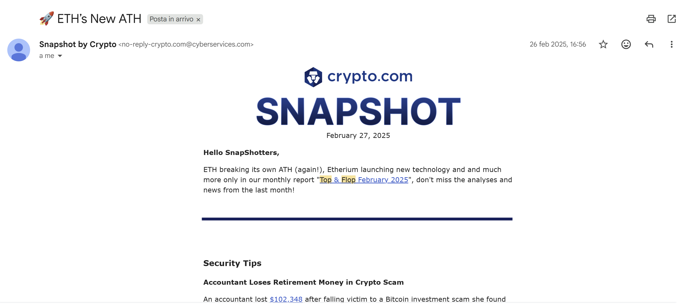

# 🔐 CyberSecurity VBA Macro Attack Simulation


> **⚠️ DISCLAIMER**: This project was created exclusively for educational and research purposes in the field of cybersecurity. Using these techniques for malicious purposes is illegal.

---

## 🎯 Project Overview

This project represents a **complete simulation of a cyber attack** based on a malicious VBA macro embedded within an Excel document. The goal is to demonstrate how an attacker can exploit social engineering techniques and steganography to compromise a system and steal sensitive information.

### Main Components

| Component | Description |
|-----------|-------------|
| **Excel Document** | Malicious file containing the VBA macro |
| **VBA Macro** | Obfuscated code that executes the attack |
| **Steganographic Image** | Image with C2 server IP encoded in pixels |
| **Information Stealer** | Script that steals sensitive files from the victim |
| **C2 Server** | Command & Control server to receive stolen data |
| **Phishing Email** | Spear phishing campaign to distribute the malware |

---

## 🎯 Attack Goal

The attack is **targeted at users subscribed to the crypto.com newsletter**, a well-known cryptocurrency exchange that suffered a data breach with email exposure.

### Specific Objectives

- **Target**: Users of the crypto.com exchange
- **Information to Steal**: Crypto wallet access data, sensitive files (`.txt`, `.xlsx`)
- **Target Folders**: Desktop, Documents, Downloads (including subfolders)
- **Purpose**: Compromise of cryptocurrency wallets

---

## 📧 Spear Phishing Campaign

To ensure the completeness of the simulation, a **spear phishing campaign** was created that mimics official crypto.com communications.

### Social Engineering Strategy

The victim receives an apparently legitimate email from the crypto.com newsletter that:

1. **Simulates official communications** from the exchange
2. **Encourages download** of an Excel file with "the latest cryptomarket news"
3. **Justifies macro activation** as necessary to "enjoy all features"

### Email Spoofing Details

The simulation was carefully crafted by creating a **highly convincing fake sender address** that closely resembles the original:

| Type | Email Address |
|------|---------------|
| **Fake (Simulation)** | `no-reply-crypto.com@cyberservices.com` |
| **Original (Legitimate)** | `no-reply@news.crypto.com` |

This technique demonstrates how attackers craft sender addresses that appear legitimate at first glance, exploiting users who don't carefully examine email headers.

### Phishing Email Screenshot



### Credibility Elements

- ✉️ Design similar to legitimate crypto.com newsletters
- 📊 Promise of exclusive crypto market content
- ⚙️ Instructions to enable macros (disguised as necessary functionality)
- 🎨 Branding consistent with the original platform
- 📨 Spoofed sender address closely mimicking the real one

---

## 🏗️ Attack Architecture

```
┌─────────────────┐      ┌─────────────────┐      ┌─────────────────┐
│   Phishing      │      │   Dropbox       │      │   C2 Server     │
│   Email         │      │   (Image)       │      │   (Flask)       │
└────────┬────────┘      └────────┬────────┘      └────────┬────────┘
         │                        │                        │
         ▼                        │                        │
┌─────────────────┐               │                        │
│   Victim        │               │                        │
│   opens Excel   │               │                        │
└────────┬────────┘               │                        │
         │                        │                        │
         ▼                        ▼                        │
┌─────────────────────────────────────────────────────────────────────┐
│                         ATTACK FLOW                                 │
├─────────────────────────────────────────────────────────────────────┤
│  1. Macro downloads image from Dropbox                              │
│  2. Extracts C2 server IP from image pixels                         │
│  3. Downloads stealer.cmd from C2 server                            │
│  4. Executes the stealer                                            │
│  5. Stealer sends sensitive files to C2 server                      │
└─────────────────────────────────────────────────────────────────────┘
```

---

## ⚡ VBA Macro Features

The VBA macro executes the following operations in sequence:

- **Download Encoded Image** from Dropbox containing the C2 server IP
- **Extract IP Address** using steganography (IP encoded in red channel of first 4 pixels)
- **Download Stealer** from C2 server using the extracted IP
- **Execute Stealer** silently and remove traces
- **Auto-execution** triggered when Excel workbook is opened

> 📄 For detailed implementation and code analysis, refer to the [Report.pdf](Report.pdf) or source files in the `src/` directory.

---

## 🔒 Obfuscation Techniques

To make static code analysis difficult and bypass antivirus controls, the following techniques were applied:

| Technique | Description |
|-----------|-------------|
| **Renaming** | Variables and functions renamed with meaningless names |
| **Comment Removal** | Elimination of all explanatory comments |
| **Formatting Removal** | Elimination of indentation and blank lines |
| **Structure Modification** | Addition of conditional statements, loops, and division into multiple methods |
| **XOR Encoding** | Simple strings encoded with XOR function (different key for each string) |
| **XOR + HEX Encoding** | Complex strings (e.g., PowerShell script) encoded with XOR and then converted to hexadecimal |

> 📄 For detailed obfuscation examples and code comparison, refer to the [Report.pdf](Report.pdf).

---

## 🖥️ Infrastructure

**Network**: NAT virtual subnet, isolated environment

**C2 Server**: Linux Mint with Flask server (`192.168.174.131:4444`)
- Endpoint `/download` serves stealer to victims
- Endpoint `/upload` receives exfiltrated files

**Victim Machine**: Windows 11 with all base protections active

> 📄 For detailed infrastructure setup, refer to the [Report.pdf](Report.pdf).

---

## 📊 Results

**VirusTotal Analysis**: Obfuscation significantly reduced detection rates compared to clean code  
🔗 [View Full Report](https://www.virustotal.com/gui/file/10509b1d705993d0d712f971444209568f396fdffda18bd76a20866ecf9fab07)

**Simulation Outcome**: ✅ Attack successfully bypassed controls, exfiltrated sensitive files, and removed traces

**Key Findings**:
- Social engineering remains the most effective attack vector
- Obfuscation significantly reduces antivirus detection
- Steganography effectively hides malicious data

> 📄 For detailed analysis and results, refer to the [Report.pdf](Report.pdf).

---

## 👥 Authors

**Vilotto Tommaso** and **Zerman Nicolò**

📅 **Date**: February 2025

---

## 📚 References

- Project created for the **CyberSecurity** course
- University of Verona
- 📄 **For detailed technical information, refer to [Report.pdf](Report.pdf)**

---

> **⚠️ Legal Notice**: This material is provided for educational purposes only. The authors assume no responsibility for the misuse of the information contained in this document.
